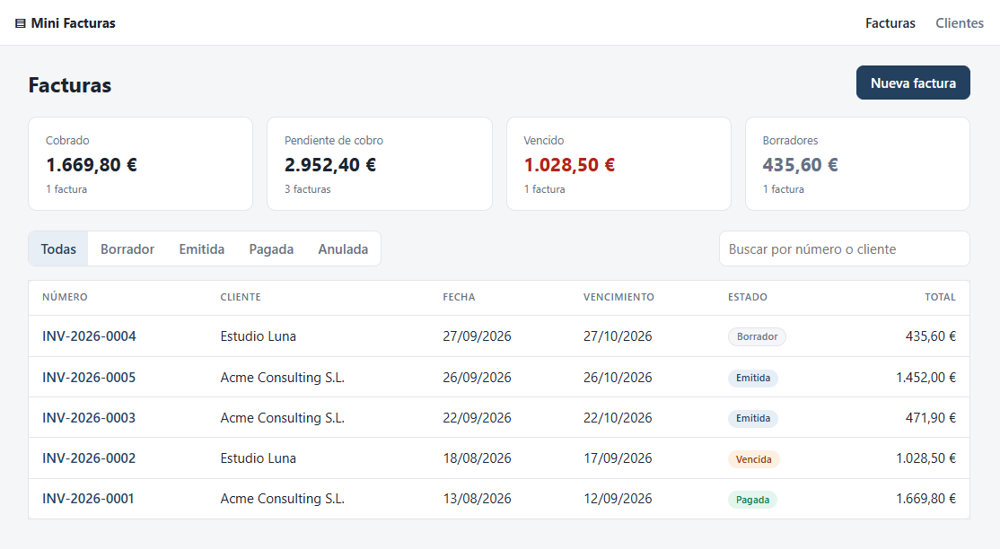
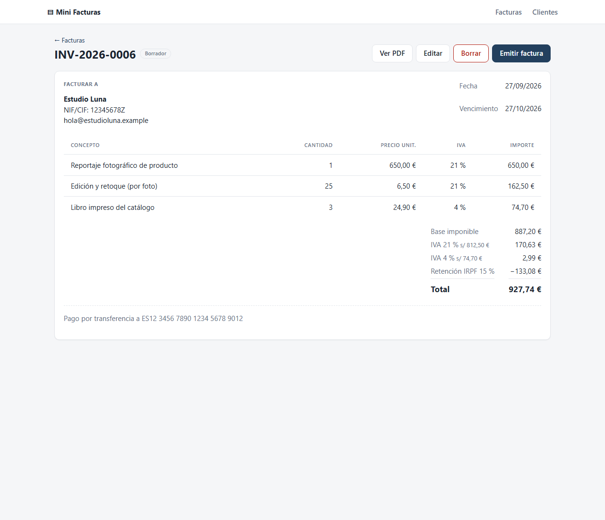
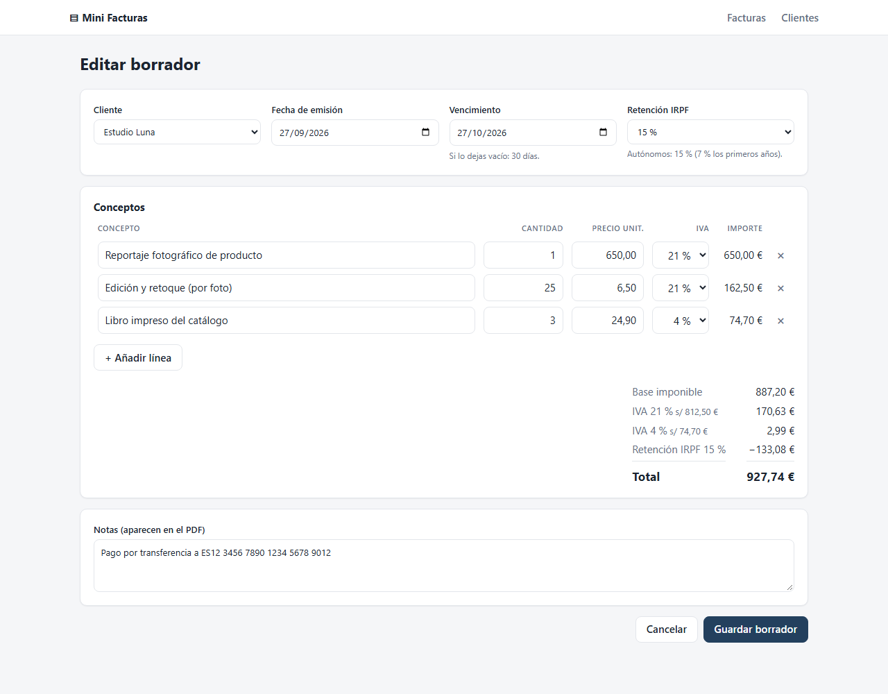

# Mini Facturas · Flask + PostgreSQL + React

[](https://github.com/jimmyrom1/mini-invoice-generator/actions/workflows/ci.yml)

Generador de facturas pequeño pero completo: gestión de clientes, facturas con varias líneas,
IVA por línea con desglose por tipos, retención de IRPF, ciclo de vida de la factura (borrador → emitida → pagada / anulada),
panel con importes cobrados y pendientes, y exportación a PDF.



| Detalle de factura | Editor con totales en vivo |
| --- | --- |
|  |  |

📄 [PDF de ejemplo generado por la API](docs/ejemplo-factura.pdf)

## Stack

| Capa | Tecnología |
| --- | --- |
| API | Python 3.12, Flask 3, SQLAlchemy 2 (tipado con `Mapped`), Marshmallow |
| Base de datos | PostgreSQL 16, migraciones con Alembic (Flask-Migrate) |
| Frontend | React 19, TypeScript, Vite, React Router |
| PDF | fpdf2 |
| Calidad | pytest (cobertura >95 %), Vitest + Testing Library, Ruff, oxlint |
| Infraestructura | Docker Compose (Postgres + Gunicorn + Nginx), GitHub Actions |

## Arrancar en un minuto

```bash
docker compose up --build
```

Abre <http://localhost:8080>. Se aplican las migraciones y se cargan datos de ejemplo
automáticamente.

## Decisiones técnicas

Estas son las partes en las que merece la pena fijarse:

- **Dinero con `Decimal`, nunca `float`.** Las columnas son `NUMERIC` y los importes se redondean
  *half-up* a céntimos. En JSON viajan como string (`"629.19"`) para no perder precisión.
- **IVA por línea y retención de IRPF, como exige una factura española.** Cada línea lleva su
  tipo (21 %, 10 %, 4 % o 0 %) y la factura muestra el desglose de base y cuota por tipo. El
  total es `base + IVA − IRPF`: la retención (15 %, o 7 % en los primeros años de actividad) la
  ingresa el cliente en Hacienda.
  - La cuota se redondea **una vez por tipo, sobre la base agrupada**, y no línea a línea. Con
    cinco líneas de 0,10 € al 21 %, redondeando cada línea saldrían 0,10 €, pero lo correcto es
    0,50 × 21 % = 0,105 → 0,11 €, lo que cuadra con el desglose impreso. Hay un test de este caso.
  - El mismo cálculo existe en tres sitios: el modelo, la consulta SQL del panel y la vista previa
    del navegador. Los tests usan los mismos números en los tres para que no se desincronicen.
  - La migración copia el IVA de cada factura a sus líneas, así que las facturas ya emitidas no
    cambian ni un céntimo (se comprobó migrando una base con datos). La API antigua sigue
    funcionando: si una línea no indica su IVA, hereda el de la factura.
- **Numeración correlativa sin condiciones de carrera.** Cada año tiene su contador
  (`INV-2026-0001`, …). Se incrementa con un único
  `INSERT … ON CONFLICT DO UPDATE … RETURNING`, que es atómico en PostgreSQL. Hay un test que
  crea 16 facturas en paralelo y comprueba que no se repite ningún número
  ([`test_invoice_numbers_are_unique_under_concurrency`](backend/tests/test_invoices.py)).
- **Máquina de estados explícita.** Las transiciones permitidas están en un diccionario
  (`ALLOWED_TRANSITIONS` en [`models.py`](backend/app/models.py)). Solo los borradores se
  pueden editar o borrar; una factura emitida solo puede pagarse o anularse.
- **Integridad también en la base de datos.** Además de validar en la API hay `CHECK`
  constraints (cantidad > 0, IVA e IRPF entre 0 y 100, vencimiento ≥ emisión), claves foráneas con
  `ON DELETE RESTRICT` y un tipo `ENUM` nativo para el estado.
- **Estadísticas calculadas en SQL.** El panel agrega los totales por estado con una consulta
  (subconsulta + `GROUP BY`), sin cargar las facturas en memoria. Un test verifica que el
  resultado coincide al céntimo con el cálculo del modelo.
- **Sin N+1.** Los listados usan `joinedload` para el cliente y `selectinload` para las líneas.
- **Errores coherentes.** Todas las respuestas de error son JSON: `422` con el detalle por campo,
  `404` y `409` para conflictos de estado. El frontend marca en rojo el campo concreto que falla.
- **Mismo origen en producción.** Nginx sirve el build de React y hace de proxy de `/api`, así que
  no hace falta CORS. En desarrollo, Vite hace de proxy hacia Flask.

## API

| Método | Ruta | Descripción |
| --- | --- | --- |
| `GET` | `/api/health` | Comprueba la conexión con la base de datos |
| `GET` / `POST` | `/api/clients` | Listar (con `?q=`) / crear clientes |
| `GET` / `PUT` / `DELETE` | `/api/clients/:id` | Detalle / editar / borrar (409 si tiene facturas) |
| `GET` | `/api/invoices` | Listado paginado con `?status=`, `?q=`, `?client_id=`, `?page=` |
| `POST` | `/api/invoices` | Crear factura (se numera automáticamente) |
| `GET` / `PUT` / `DELETE` | `/api/invoices/:id` | Detalle / editar / borrar (solo borradores) |
| `PATCH` | `/api/invoices/:id/status` | Cambiar estado según la máquina de estados |
| `GET` | `/api/invoices/:id/pdf` | Descargar la factura en PDF |
| `GET` | `/api/invoices/stats` | Totales por estado e importe vencido |

Ejemplo:

```bash
curl -X POST http://localhost:8080/api/invoices \
  -H 'Content-Type: application/json' \
  -d '{
        "client_id": 1,
        "tax_rate": "21",
        "items": [{"description": "Consultoría", "quantity": "10", "unit_price": "50.00"}]
      }'
```

## Desarrollo local (sin Docker)

Requisitos: Python 3.12, Node 20+ y PostgreSQL.

```bash
# Base de datos
createuser -P invoices                        # contraseña: invoices
createdb -O invoices invoices
createdb -O invoices invoices_test

# Backend → http://localhost:5000
cd backend
python -m venv .venv && source .venv/bin/activate   # Windows: .venv\Scripts\activate
pip install -r requirements-dev.txt
cp .env.example .env
flask --app wsgi db upgrade
flask --app wsgi seed
flask --app wsgi run

# Frontend → http://localhost:5173
cd frontend
npm install
npm run dev
```

## Tests

```bash
cd backend  && pytest --cov=app      # 35 tests contra PostgreSQL real
cd frontend && npm test              # Vitest + Testing Library
```

La CI ejecuta en cada push:
1. Lint, formato y tests del backend contra un servicio de PostgreSQL, y la migración de ida y
   vuelta (`upgrade → downgrade → upgrade`).
2. Lint, comprobación de tipos, tests y build del frontend.
3. Un smoke test que levanta el `docker compose` completo y prueba la API, el PDF y el
   enrutado de la SPA a través de Nginx.

## Estructura

```
backend/
  app/
    models.py        # Modelos, redondeo monetario, máquina de estados, contador
    schemas.py       # Validación y serialización (Marshmallow)
    routes/          # Blueprints: clients, invoices, health
    pdf.py           # Generación del PDF
    cli.py           # `flask seed`
  migrations/        # Alembic
  tests/
frontend/
  src/
    api.ts           # Cliente HTTP tipado
    money.ts         # Vista previa de totales (mismo redondeo que el backend)
    components/      # ItemsEditor, StatusBadge
    pages/           # Dashboard, InvoiceForm, InvoiceDetail, Clients
docker-compose.yml
```

## Qué añadiría después

- Autenticación y varios emisores (multi-tenant).
- Envío de la factura por email.
- Facturas rectificativas en lugar de anular.

## Otros proyectos

Forma parte de una serie de proyectos con el mismo enfoque: reglas de negocio garantizadas
por la base de datos o por funciones puras, tests que prueban los casos difíciles y CI en cada push.

| Proyecto | Qué es |
| --- | --- |
| [LoL Tracker API](https://github.com/jimmyrom1/lol-tracker-api) | Backend en Node.js 24 + TypeScript + Fastify: proxy de la API de Riot con caché compartida en PostgreSQL, límite de peticiones y la key solo en el servidor. |
| [LoL Tracker](https://github.com/jimmyrom1/lol-tracker) | App Android nativa: Kotlin, Jetpack Compose, Room, Hilt, multimódulo e importación de partidas desde la API de Riot. |
| [Subscriptions API](https://github.com/jimmyrom1/subscriptions-api) | API REST con Java 21 y Spring Boot 4: prorrateo, facturación idempotente, ShedLock, Flyway y Testcontainers. |
| [Reserva de salas](https://github.com/jimmyrom1/room-booking) | Flask + PostgreSQL + React: reservas sin solapes garantizadas por un `EXCLUDE` de PostgreSQL, JWT y exportación a calendario. |
| [Double-Entry Ledger](https://github.com/jimmyrom1/double-entry-ledger) | FastAPI + Asyncpg + PostgreSQL + React: motor contable con invariante de suma cero diferido, inmutabilidad y bloqueos pesimistas ordenados. |
| [Rate Limiter & Circuit Breaker gRPC](https://github.com/jimmyrom1/rate-limiter-grpc) | Go + gRPC + Protocol Buffers: control de tráfico (~90 ns/op) con Token Bucket, Sliding Window, Leaky Bucket y Circuit Breaker. |
| [Live Auction Engine](https://github.com/jimmyrom1/live-auction-engine) | Node.js 24 + WebSockets + SQLite WAL + React 19: subastas en tiempo real con resolución atómica de carreras concurrentes y anti-sniping. |
| [Subscription Billing .NET](https://github.com/jimmyrom1/subscription-billing-dotnet) | .NET 9 + C# + EF Core + SQLite: motor de facturación recurrente con prorrateo exacto al segundo, dunning de 3 intentos e idempotencia HTTP. |
| [Anime Tracker](https://github.com/jimmyrom1/anime-tracker) | ASP.NET Core 10 + EF Core + PostgreSQL + Angular 22: lista de anime y manga al estilo MyAnimeList con catálogo de AniList, "+1" sin perder episodios y estadísticas. |


## Licencia

MIT
